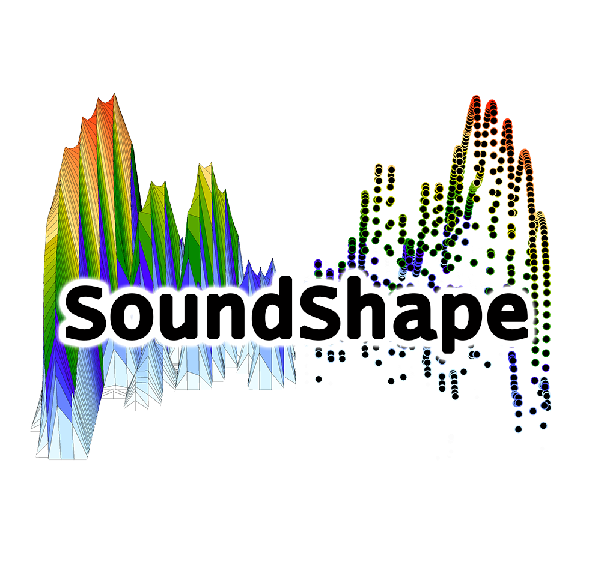

# Welcome to *SoundShape* 
Here, you will find informations on a promising, yet little explored approach for biacoustical analysis: the *eigensound* protocol (MacLeod el al., 2013). 

This somewhat new approach focuses on the direct comparison between stereotyped (*i.e.* homologous) acoustic units from different species. In light of the protocols originally described, `SoundShape` package was built to enable anyone to easily go from sound waves onto Principal Components using tools extracted from traditional Bioacoustics (*i.e.* `tuneR` and `seewave` packages) and Geometric Morphometrics (*i.e.* `geomorph` package).

## Getting started
**Note:** This is still an early version of `SoundShape`. Should you experience any errors, please feel free to provide feedback or report any [issues here](https://github.com/p-rocha/SoundShape/issues).

### Instalation
`SoundShape` is currently available on `R` platform as a development version from GitHub. In order to download it, make sure to have an updated `R` version (>=3.3.1) and the package `devtools`. 

```yml
# In case you don't have devtools
# install.packages("devtools")

# Install the development version from GitHub:
devtools::install_github("p-rocha/SoundShape")
```

### Workflow using `SoundShape`
The method described by MacLeod et al. (2013) considers the graphical representation of sound (*i.e.* a spectrogram) as complex three-dimensional surfaces from which topologically homologous semilandmarks (SM) are acquired. 


## Crossing the bridge between Bioacoustics and Geometric Morphometrics

The three-dimensional SM coordinates can be submitted to Principal Components Analysis, which will calculate new variables (Principal Components – PC) that are independent from each other and represent the axis of greatest
variation in the dataset of sound waves. By doing so, complex waves are now be described by a few PCs that can be used to produce ordination plots encompassing the majority of variation among the calls.

Although MacLeod et al. (2013) clearly stated the methods for SM acquisition, they did not mention the softwares required for the so called *eigensound analysis*. Therefore, `SoundShape` package feature a set of functions that reproduce the methods from the positioning of sounds at beggining of sound window until the PCA plot with convex hulls around each group. 


## References
MacLeod, N., Krieger, J. & Jones, K. E. (2013). Geometric morphometric approaches to acoustic signal analysis in mammalian biology. *Hystrix, the Italian Journal of Mammalogy, 24*(1), 110-125.

Rocha, P. & Romano, P. (*in prep*) The shape of sound: A new `R` package that crosses the bridge between Bioacoustics and Geometric Morphometrics.

