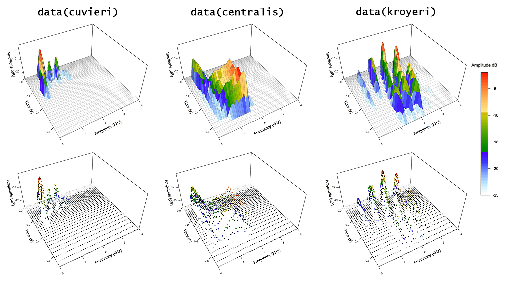

# Welcome to *SoundShape*
Here, you will find informations on a promising, yet little explored method for biacoustical analysis: the *eigensound* protocol ([MacLeod *et al.*, 2013](http://www.italian-journal-of-mammalogy.it/Geometric-Morphometric-Approaches-to-Acoustic-Signal-Analysis-in-Mammalian-Biology,77249,0,2.html)). 

Eigensound is a multidisciplinary method that crosses the bridge between Bioacoustics and Geometric Morphometrics, thus enabling the direct comparison between stereotyped calls from different species. Although well described by Macleod *et al.*, the method still lacked a viable platform to run the analysis, meaning that the bridge was still not "crossable" for those unfamiliar with programming codes.

`SoundShape` package was built to fill this gap. It feature functions that enable anyone to easily go from sound waves to Principal Components Analysis, using tools extracted from traditional Bioacoustics (*i.e.* [tuneR](https://cran.r-project.org/web/packages/tuneR/index.html) and [seewave](http://rug.mnhn.fr/seewave/) packages), Geometric Morphometrics (*i.e.* [geomorph](https://cran.r-project.org/web/packages/geomorph/index.html) package) and multivariate analysis (*e.g.* [stats](https://stat.ethz.ch/R-manual/R-devel/library/stats/html/00Index.html) package). In addition to the original description (MacLeod *et al.,* 2013), we are currently developing a throughout paper detailing `SoundShape` (Rocha & Romano *in prep*).

Thanks for using `SoundShape` and enjoy your reading!

**Note:** This is still an early version of `SoundShape`. Should you experience problems running any function, please feel free to [report any issues here](https://github.com/p-rocha/SoundShape/issues).

### A three-dimensional approach to bioacoustical analysis 
Eigensound is centered around homologous acoustic units from different species (MacLeod *et al.*, 2013), which are often the most stereotyped calls within a biological group (Rocha & Romano *in prep*). The method considers the graphical representation of sound waves (*i.e.* a spectrogram) as complex three-dimensional surfaces from which topologically homologous points (*i.e.* analogous to geometric morphometric semilandmarks) can be sampled using a grid.


**Figure 1:** Graphical outputs using `cuvieri` sample from `SoundShape` package. `seewave` package: a) Oscillogram created with `oscillo` function and b) 2D spectrogram - `spectro` function. `SoundShape` package: c) 3D spectrogram - `threeDspectro` function, d) 3D spectrogram with sampling grid - `threeDspectro`, and e) points (*i.e.* semilandmarks) sampled from 3D spectrogram data - `threeDspectro`.

[Codes for the images](https://github.com/p-rocha/SoundShape/blob/master/Codes_for_threeDspectro.R)

## Getting started

### Instalation
`SoundShape` package is available on [R platform](https://www.r-project.org/) as a development version from [GitHub](https://github.com/). In order to download it, make sure to have already installed an updated `R` version (*i.e.* 3.3.1 or above) and [devtools](https://www.rstudio.com/products/rpackages/devtools) package.

```r
# devtools - In case you don't have it
install.packages("devtools")

# SoundShape - Install the development version from GitHub
devtools::install_github("p-rocha/SoundShape")
```

### Workflow using `SoundShape` package

### 1. Create folder to store acoustic units
The `eigensound` function (`SoundShape` package) focus on the acquisition of point coordinates (*i.e.* semilandmarks) from multiple `".wav"` files, which must be stored on the same folder, somewhere in your computer. 

This folder can be created manually at your console and assigned as [working directory](http://rprogramming.net/set-working-directory-in-r/). Alternatively, one can create the folder at the current working directory using `dir.create`. 

Also create a subfolder to store the upcoming outputs from `eigensound`.

```r
# Create folder to store ".wav" files
wav.at <- file.path(getwd(), "example SoundShape")
dir.create(wav.at)

# Create subfolder to store results
store.at <- file.path(getwd(), "example SoundShape/output")
dir.create(store.at)
```

### 2. Definition of stereotyped acoustic units
Since eigensound is centered around stereotyped acoustic units, the first and foremost step in sound shape study is the careful definition of units from which analysis will be based on. Although there is no universal concept of a homologous unit of biological sound encompassing the majority of calling organisms, each higher taxon has its own approaches for homologous sound comparison (Rocha & Romano *in prep*). Here, we focused on stereotyped notes from the advertisement calls of three *Physalaemus* species (Amphibia, Anura, Leptodactylidae): *P. centralis* (`centralis` sample data), *P. cuvieri* (`cuvieri` sample data), and *P. kroyeri* (`kroyeri` sample data). When dealing with real life data, do some literature search before defining your acoustic unit.

Once the stereotyped units have been defined (Fig. 2), a reasonable number of units should be selected from the sample and stored as new `".wav"` files on the folder specified by `wav.at`. Each `".wav"` file should represent a single acoustic unit selected from the original sound wave. Besides, selection must account for optimal signal to noise ratio (*i.e.* "clean" recording), and no overlapping frequencies from other individuals, species, or background noise. Editing and filtering of sound waves must be restricted to a bare minimum. 


**Figure 2:** Spectrogram image of `cuvieri` sample (`SoundShape` package) containing a sequence of three stereotyped notes from the advertisement call of *P. cuvieri*. Each note represent a comparable acoustic unit.

##### Codes for the image:
```r
# Sample data from SoundShape package
data(cuvieri)

# Plot spectro from sample and highlight acoustic units
seewave::spectro(cuvieri, flim = c(0,2.5))
graphics::abline(v=c(0.05, 0.45, 0.73, 1.13, 1.47, 1.87), lty=2)
```

### 3. Select and store acoustic units as separate `".wav"` files
Once the acoustic units have been defined, the selection can be performed on numerous softwares of acoustic analysis outside `R` platform (*e.g.* [Audacity](https://www.audacityteam.org/), [Raven Pro](http://ravensoundsoftware.com/software/raven-pro/)). 

Or, we can use some functions from [seewave](http://rug.mnhn.fr/seewave/):

```r
# Select acoustic units
cut.cuv1 <- seewave::cutw(cuvieri, f=44100, from=0.05, to=0.45, output = "Wave")
cut.cuv2 <- seewave::cutw(cuvieri, f=44100, from=0.73, to=1.13, output = "Wave")
cut.cuv3 <- seewave::cutw(cuvieri, f=44100, from=1.47, to=1.87, output = "Wave")

# Export new ".wav" files containing acoustic units; store on previosly created folder
seewave::writeWave(cut.cuv1, filename=file.path(wav.at, "cut.cuv1.wav"), extensible=FALSE)
seewave::writeWave(cut.cuv2, filename=file.path(wav.at, "cut.cuv2.wav"), extensible=FALSE)
seewave::writeWave(cut.cuv3, filename=file.path(wav.at, "cut.cuv3.wav"), extensible=FALSE)
```

Given that eigensound analysis focuses on the direct comparison between stereotyped calls from different species, populations, or individuals, we also aquired stereotyped units from `centralis` and `kroyeri` samples (*Physalaemus centralis* and *P. kroyeri*, respectively) (Fig. 3) in order to compare with `cuvieri`. Selection of units was performed using an adaptation of the codes above. New `".wav"` files were then stored on the same folder of `cuvieri` samples (`wav.at`). Codes omitted for practical reasons (redundancy).

In the end, our sample data was composed of nine acoustic units, three per species.


**Figure 3:** Spectrogram images of `centralis` and `kroyeri` samples (`SoundShape` package) containing sequences of three stereotyped notes from each species advertisement call.

### 4. Define dimensions for the sound window 
Once the sample of `".wav"` files is stored on a single folder from which one could run `eigensound` function (`SoundShape` package), the eigensound protocol still require a few actions to secure a meaningful comparison of point coordinates (*i.e.* semilandmarks). 

First, it is necessary to define the sound window dimensions for time (X-axis) and frequency (Y-axis) (*i.e.* arguments `tlim` and `flim`, respectively; `eigensound` function). This action ensure that all sounds from the sample are encompassed by the window. To facilitate this iterative process, use `eigensound` with arguments `analysis.type = "twoDshape` and `plot.exp = TRUE`, which will create two-dimensional spectrogram plots for each `".wav"` file on the folder specified by `wav.at`, and store the output images on the folder specified by `store.at`. 

Second is the definition of a relative amplitude value (`dBlevel`) to use as background in the 3D spectrogram (MacLeod *et al.*, 2013). This is also an iterative process that is facilitated by `eigensound` with arguments `analysis.type = "twoDshape` and `plot.exp = TRUE`, and should lead to spectrogram images with minimum influence from background noise. 

In our example including `cuvieri`, `centralis`, and `kroyeri`, the sound window that encompass our whole sound data was defined with `flim = c(0, 4)` and `tlim = c(0, 0.7)` (Fig. 4). The relative amplitude was `dBlevel = 25`.

```r
# Iteratively define sound window dimensions and relative amplitude background
eigensound(analysis.type="twoDshape", plot.exp=TRUE, dBlevel = 25, flim=c(0, 4), tlim=c(0, 0.7), 
           wav.at=wav.at, store.at=store.at)

# Go to folder specified by store.at and check jpeg files created
# Try other settings (tlim, flim, dBlevel) until ideal configuration
```


**Figure 4:** Sound window dimensions (`flim = c(0, 4)` and `tlim = c(0, 0.7)`) highlighted by red circles. Spectrogram images from the sample of `cuvieri`, `centralis` and `kroyeri`. 

### 5. Alignment of acoustic units at beggining of sound window
Each call from the sample must be placed at the beggining of the sound window, which ensure that variation in each semilandmark is due to energy shifts within the call, not to changes in their relative position within the sound window. This procedure is analogous to transposing operation in Generalized Procrustes Analysis (Zeldich *et al.*, 2012).

This arbitrary alignment can be performed with `align.wave` function (`SoundShape` package), which will recreate each `".wav"` file on a given folder while placing the acoustic units at the beggining of sound window. Placement is based on the relative amplitude value (`dBlevel`) and also considers the `time.lenght` that encompass all sounds in the study. New `".wav"` files are stored on a new folder (`wav.to = "Aligned"`) from which the analysis can be run. 

In order to verify the alignment, run `eigensound` function (`SoundShape` package) with `analysis.type = "twoDshape"` and `plot.exp = TRUE` (Fig. 5). Given that aligned waves were stored elsewhere, adapt the `wav.at` argument.

```r
# Place sounds at beggining of sound window
align.wave(wav.at=wav.at, wav.to="Aligned", time.length = 0.8, dBlevel = 25)

# Verify alignment using analysis.type = "twoDshape"
eigensound(analysis.type="twoDshape", wav.at = file.path(wav.at, "Aligned"), store.at=store.at, 
           plot.exp=TRUE, flim=c(0, 4), tlim=c(0, 0.7), dBlevel = 25)
           
# Go to folder specified by store.at and check jpeg files created
```


**Figure 5:** Acoustic units aligned at beggining of sound window. Spectrogram images from the samples of `cuvieri`, `centralis` and `kroyeri`. 

### 6. Acquire semilandmark coordinates for each ".wav" file on a folder 
Once the relative amplitude is set (`dBlevel`), sound window dimensions are defined (`tlim`, `flim`), and the acoustic units are placed at beggining of sound window (`align.wave` function, `SoundShape` package), the final step is to establish the number of cells per side on our sampling grid (*i.e.* `x.length` and `y.length` arguments). 

Keep in mind that the number semilandmarks (*i.e.* variables in our dataset) acquired by `eigensound` function (`SoundShape` package) will be given by the multiplication of `x.length` and `y.length`. Therefore, a large sampling grid might be computatinally demanding, whereas a small grid could be an oversimplification of the sound surface. In our example, we opted for 80 cells on the time (X-axis, `x.length = 80`) and 60 cells on the frequency (Y-axis, `y.length = 60`), thus resulting in 4800 semilandmarks. 

**Note:** In the original proposal (MacLeod *et al.*, 2013), eigensound was employed on a sample of short duration calls, which only required a short sound window (*i.e.* 0.1023 s) and a rather small sampling grid (*i.e.* 30 or 25 cells per side). However, if the sample include calls with distinct durations (*e.g.* from 0.3 s to 0.7 s; see Fig. 5), it can lead to a large “blank” space in the sound window. That imply on the sampling grid prioritizing the few species with long duration calls, whereas the remaining species will present remarkably similar SM configurations. As a way around this issue, `eigensound` feature the option of using a logarithmic scale on the time (X-axis) (`log.scale = TRUE`), which emphasize the short duration calls whilst also encompassing the long ones (Rocha & Romano *in prep*) (Fig. 6).

#### Run `eigensound`

For each aligned `".wav"` file on the folder specified by `wav.at`, the function will compute spectrogram data and acquire semilandmarks using the 3D representation of sound (`analysis.type = "threeDshape"`) and export of simplified sound surfaces calculated from the point coordinates (Fig. 6).

Results can be simultaneosly assigned to an `R` object, and/or stored as the native file format of TPS series ([Rohlf, 2015](http://www.italian-journal-of-mammalogy.it/The-tps-series-of-software,77186,0,2.html)), a `".tps"` file to be used by numerous softwares of geometric analysis of shape. Here, we focus on the analysis within `R` platform ([geomorph](https://cran.r-project.org/web/packages/geomorph/index.html) package), so the results are only stored as `eig.sample` object.

```r
# Run eigensound function on aligned wave files and store results as R object
eig.sample <- eigensound(analysis.type="threeDshape", flim=c(0, 4), tlim=c(0, 0.7), dBlevel = 25,
                         plot.exp = TRUE, wav.at = file.path(wav.at, "Aligned"), store.at = store.at, 
                         x.length = 80, y.length = 60, log.scale = TRUE)

# Export 3D graphs with semilandmarks as colored points
eigensound(analysis.type="threeDshape", flim=c(0, 4), tlim=c(0, 0.7), dBlevel = 25,
           x.length = 80, y.length = 60, log.scale = TRUE, plot.exp = TRUE, plot.type = "points",
           wav.at = file.path(wav.at, "Aligned"), store.at = store.at)

# Go to folder specified by store.at and check jpeg files created
```



**Figure 6:** Simplified sound surfaces and semilandmarks calculated from aligned `".wav"` files. Spectrogram images from the sample of `cuvieri`, `centralis` and `kroyeri`. 

**Note:** `eig.sample` object is available as sample data from `SoundShape` package.

```r
# Access sample of 3D semilandmark coordinates
data(eig.sample)
```


### 7. Principal Components Analysis
The three-dimensional point coordinates stored in `eig.sample` (`SoundShape` package) can be submitted to Principal Components Analysis. 

By doing so, complex waves can be described and plotted onto major variance axes (PCs). These are used for ordination analysis (Fig. 7) encompassing the majority of variance observed (same as in MacLeod *et al.*, 2013).

```r
# PCA using three-dimensional semilandmark coordinates
pca.eig.sample <- stats::prcomp(geomorph::two.d.array(eig.sample))
```

**Note:** At this point, consider employing a stopping rule to select which PCs should be retained as nontrivial and interpretable, and which ones should be ignored (*e.g.* broken stick models, [vegan](http://cc.oulu.fi/~jarioksa/softhelp/vegan/html/screeplot.cca.html) package) (Jackson, 1993; Rocha & Romano *in prep*). 

### 8. Hypothetical sound surfaces and ordination of Principal Components
Before proceeding to the ordination plot, create hypothetical sound surfaces for the calculated Principal Components using `hypo.surf` function (`SoundShape` package). This function creates three-dimensional plots containing hypothetical surfaces that represent minimum and maximum deformations relative to Principal Components. 

These hypothetical surfaces must be interpreted along with the ordination of Principal Components (*e.g.* `pca.plot`), both featuring the same object containing three-dimensional point coordinates (*e.g.* `eig.sample`). By doing so, `hypo.surf` enhance the comprehension on how sound shape changed along the ordination axis (Fig. 7).

**Note:** Some of codes from `hypo.surf` were adapted from [plotTangentSpace](https://www.rdocumentation.org/packages/geomorph/versions/3.1.2/topics/plotTangentSpace) (`geomorph` package; Adams *et al.*, 2013). More specifically, the code chunk related to the acquisition of hypothetical point configurations for each Principal Component (calculated by `prcomp`, `stats` package) is exactly the same as in `plotTangentSpace`.

```r
# Create factor to use as groups in subsequent ordination plot
sample.gr <- factor(c(rep("centralis", 3), rep("cuvieri", 3), rep("kroyeri", 3)))

# Plot result of Principal Components Analysis
pca.plot(PCA.out = pca.eig.sample, groups = sample.gr, conv.hulls = sample.gr,
         main="PCA of 3D coordinates", leg=TRUE, leg.pos = "top")

# Verify hypothetical sound surfaces using hypo.surf
hypo.surf(threeD.out=eig.sample, PC=1, flim=c(0, 4), tlim=c(0, 0.7), x.length=80, y.length=60)
hypo.surf(threeD.out=eig.sample, PC=2, flim=c(0, 4), tlim=c(0, 0.7), x.length=80, y.length=60)
```


 **Figure 7:** Ordination analysis (center) using `eig.sample` data acquired from the sample of `cuvieri`, `centralis` and `kroyeri`. Hypothetical sound surfaces (edges) representing minimum and maximum deformations relative to Principal Components.
 

## References
Adams, D.C. & Otárola-Castillo, E. (2013) Geomorph: An R package for the collection and analysis of geometric morphometric shape data. *Methods in Ecology and Evolution 4*, 393–399. 

Jackson, D. A. (1993). Stopping rules in Principal Components Analysis: A comparison of heuristical and statistical
approaches. *Ecology, 74*(8), 2204-2214.

MacLeod, N., Krieger, J. & Jones, K. E. (2013). Geometric morphometric approaches to acoustic signal analysis in mammalian biology. *Hystrix, the Italian Journal of Mammalogy, 24*(1), 110-125.

Rocha, P. & Romano, P. (*in prep*) The shape of sound: A new `R` package that crosses the bridge between Bioacoustics and Geometric Morphometrics.

Rohlf, F.J. (2015) The tps series of software. *Hystrix 26*, 9-12.

Zelditch, M. L., Swiderski, D. L., Sheets, H. D., & Fink, W. L. (2012). *Geometric morphometrics for biologists: A primer*. Elsevier (Second Edition). Elsevier, San Diego. 

