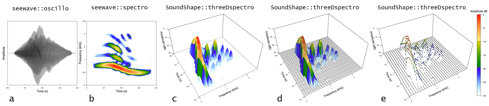

# Welcome to *SoundShape*!
Here, you will find informations on a promising, yet little explored method for biacoustical analysis: the *eigensound* protocol ([MacLeod *et al.*, 2013](http://www.italian-journal-of-mammalogy.it/Geometric-Morphometric-Approaches-to-Acoustic-Signal-Analysis-in-Mammalian-Biology,77249,0,2.html)). 

Eigensound is a multidisciplinary approach that crosses the bridge between Bioacoustics and Geometric Morphometrics, thus enabling the direct comparison between stereotyped calls from different species. Although well described by Macleod *et al.*, the method still lacked a viable platform to run the analysis, meaning that the bridge was still not *crossable* for those unfamiliar with programming codes.

`SoundShape` package was built to fill this gap. It feature functions that enable anyone to easily go from sound waves to Principal Components, using tools extracted from traditional Bioacoustics (*i.e.* [tuneR](https://cran.r-project.org/web/packages/tuneR/index.html) and [seewave](http://rug.mnhn.fr/seewave/) packages), Geometric Morphometrics (*i.e.* [geomorph](https://cran.r-project.org/web/packages/geomorph/index.html) package) and multivariate analysis (*e.g.* [stats](https://stat.ethz.ch/R-manual/R-devel/library/stats/html/00Index.html) package). In addition to the original description (MacLeod *et al.,* 2013), we are currently developing a throughout paper detailing `SoundShape` (Rocha & Romano *in prep*).

Thanks for using `SoundShape` and enjoy your reading!

**Note:** This is still an early version of `SoundShape`. Should you experience problems running any function, please feel free to report any [issues here](https://github.com/p-rocha/SoundShape/issues).

### A three-dimensional approach to bioacoustical analysis 
Eigensound analysis is centered around homologous acoustic units between species (MacLeod *et al.*, 2013), which are often the most stereotyped calls within a biological group (Rocha & Romano *in prep*). The method considers the graphical representation of sound waves (*i.e.* a spectrogram) as complex three-dimensional surfaces from which topologically homologous points (*i.e.* semilandmarks) can be sampled using a grid.

An easy way to visualize sound waves (a, b) as three-dimensional graphs is using the function `threeDspectro` from `SoundShape` package. The function enable its user to create 3D graphs from spectrogram data with (d), or without (c) a sampling grid. Alternatively, it is also possible the visualization of semilandmarks as colored points (e) sampled from spectrogram data.

<p align="center">
  
</p>

[Codes for the images](https://github.com/p-rocha/SoundShape/blob/master/Codes%20for%20threeDspectro.R)

## Getting started

### Instalation
`SoundShape` package is available on [R platform](https://www.r-project.org/) as a development version from [GitHub](https://github.com/). In order to download it, make sure to have already installed an updated `R` version (>=3.3.1) and [devtools](https://www.rstudio.com/products/rpackages/devtools) package. 

```r
# devtools - In case you don't have it
install.packages("devtools")

# SoundShape - Install the development version from GitHub
devtools::install_github("p-rocha/SoundShape")
```

## Workflow using `SoundShape` package

### 1. Create folder to store acoustic units
The `eigensound` function focus on the acquisition of SM coordinates from multiple `".wav"` files, which must be stored on the same folder somewhere in your computer. 

This folder can be created manually at your console and assigned as [working directory](http://rprogramming.net/set-working-directory-in-r/). Or we can create the folder at the current working directory using `dir.create`. 

Also create a subfolder to store the upcoming outputs from `eigensound`.

```r
# Create folder to store ".wav" files
wav.at <- file.path(getwd(), "example SoundShape")
dir.create(wav.at)

# Create subfolder to store results
store.at <- file.path(getwd(), "example SoundShape/output")
dir.create(store.at)
```

### 2. Definition of stereotyped acoustic units
Since eigensound is centered around stereotyped acoustic units, the first and foremost step in sound shape study is the careful definition of units from which analysis will be conducted. Although there is no universal concept of a homologous unit of biological sound encompassing the majority of calling organisms, each higher taxon has its own approaches for homologous sound comparison (Rocha & Romano *in prep*). Therefore, do some literature search before defining your acoustic unit.

Once the stereotyped units have been defined, a reasonable number of units should be selected from the sample and stored as new `".wav"` files on the folder specified by `wav.at`. Each `".wav"` file should represent a single acoustic unit selected from the original sound wave. Besides, selection must account for optimal signal to noise ratio (*i.e.* "clean" recording), and no overlapping frequencies from other individuals, species, or background noise. Editing and filtering of sound waves must be restricted to a bare minimum. 

In the `cuvieri` sample from `SoundShape` package, for instance, there are three stereotyped calls of *Physalaemus cuvieri* (Amphibia, Anura, Leptodactylidae) emitted in a sequence, each constituting a comparable acoustic unit.


##### Codes for the image:
```r
# Sample data from SoundShape
data(cuvieri)

# Plot spectro from sample and highlight acoustic units
seewave::spectro(cuvieri, flim = c(0,2.5))
graphics::abline(v=c(0.05, 0.45, 0.73, 1.13, 1.47, 1.87), lty=2)
```

### 3. Select and store acoustic units as separate `".wav"` files
Once the acoustic units have been defined, the selection can be performed on numerous softwares of acoustic analysis outside `R` platform (*e.g.* [Audacity](https://www.audacityteam.org/), [Raven Pro](http://ravensoundsoftware.com/software/raven-pro/)). 

Or, we can use some functions from [seewave](http://rug.mnhn.fr/seewave/):

```r
# Select acoustic units
cut.cuv1 <- seewave::cutw(cuvieri, f=44100, from=0.05, to=0.45, output = "Wave")
cut.cuv2 <- seewave::cutw(cuvieri, f=44100, from=0.73, to=1.13, output = "Wave")
cut.cuv3 <- seewave::cutw(cuvieri, f=44100, from=1.47, to=1.87, output = "Wave")

# Export new ".wav" files containing acoustic units; store on previosly created folder
seewave::writeWave(cut.cuv1, filename=file.path(wav.at, "cut.cuv1.wav"), extensible=FALSE)
seewave::writeWave(cut.cuv2, filename=file.path(wav.at, "cut.cuv2.wav"), extensible=FALSE)
seewave::writeWave(cut.cuv3, filename=file.path(wav.at, "cut.cuv3.wav"), extensible=FALSE)
```

Given that eigensound analysis focuses on the direct comparison between stereotyped calls from different species, we also aquired stereotyped units from `centralis` and `kroyeri` samples (*Physalaemus centralis* and *P. kroyeri*, respectively) in order to compare with `cuvieri`. Selection of units was made through an adaptation of the codes above. New `".wav"` files were stored on the same folder of `cuvieri` samples (`wav.at`). Codes omitted for practical reasons.

In the end, our sample data was composed of nine acoustic units, three per species.


### 4. Define dimensions for the sound window 
Although our sample of `".wav"` files is now stored on a single folder from which `eigensound` could proceed with semilandmark acquisition, the eigensound protocol still require a couple of actions before actually acquiring sonic semilandmarks.

First is the definition of a relative amplitude value (`dBlevel`) to use as background in the 3D spectrogram. This an iterative process that should lead to minimum influence from background noise. However, it does not eliminate the variance given by
different placement of sounds within the sound window of a spectrogram---nor the variance from changes in the dimensions of the window itself. 

Therefore, second is the definition of sound window dimensions of time (X-axis) and frequency (Y-axis) (*i.e.* arguments `tlim` and `flim`, respectively, from `eigensound` function). These must be defined prior to acquiring three-dimensional coordinates using `eigensound`, granting that the window encompasses all sounds from the sample. This is an iterative process that can be quite arduous outside `R` platform.

Thus, we use `eigensound` with arguments `analysis.type = "twoDshape` and `plot.exp = TRUE`, which will create two-dimensional spectrogram plots for each `".wav"` file on the folder specified by `wav.at`, and store the images on the folder specified by `store.at`. In addition, this is also very useful when defining the relative amplitude value (`dBlevel`).

In our example including `cuvieri`, `centralis`, and `kroyeri`, we defined iteratively that the sound window that encompassed our whole sound data has dimensions `flim = c(0, 4)` and `tlim = c(0, 0.7)`. The relative amplitude that minimized background noise was `dBlevel = 25`.

```r
# Iteratively define sound window dimensions and relative amplitude background
eigensound(analysis.type="twoDshape", plot.exp=TRUE, dBlevel = 25, flim=c(0, 4), tlim=c(0, 0.7), 
           wav.at=wav.at, store.at=store.at)

# Go to folder specified by store.at and check jpeg files created
# Try other settings until achieving ideal dimensions
```

IMAGEM:  TRES SONOGRAMAS COM NOTAS DESALINHADAS NA JANELA

### 5. Alignment of units at beggining of sound window
Ultimately, each call from our sample must be placed at the beggining of the sound window. This ensures that variation in each semilandmark is due to energy shifts within the call, and not to changes in their position within the sound window.

Alignment is easily performed with `align.wave` function. It considers the `time.lenght` that encompasses all sounds in the study, and uses the relative amplitude value (`dBlevel`) as reference for call placement.

In order to verify the alignment, we once again run `eigensound` with `analysis.type = "twoDshape"` and `plot.exp = TRUE`. Given that aligned waves were stored elsewhere, we adapt the `wav.at` argument.

```r
# Place sounds at beggining of sound window
align.wave(wav.at=wav.at, wav.to="Aligned", time.length = 0.8, dBlevel = 25)

# Verify alignment using analysis.type = "twoDshape"
eigensound(analysis.type="twoDshape", wav.at = file.path(wav.at, "Aligned"), store.at=store.at, 
           plot.exp=TRUE, flim=c(0, 4), tlim=c(0, 0.7), dBlevel = 25)
```

IMAGEM:  TRES SONOGRAMAS COM NOTAS ALINHADAS NA JANELA


 so that `eigensound` can compute spectrogram data and acquire semilandmarks that can be within the sample of species. 
For each `".wav"` file on a given folder, `eigensound` will compute spectrogram data and acquire SM using a three-dimensional representation of sound (`analysis.type = "threeDshape"`), or the cross-correlation between energy quantiles and a curve of relative amplitude (`analysis.type = "twoDshape"`). The results can be simultaneosly assigned to an `R` object, and/or stored as a `".tps"` file to be used by numerous softwares of geometric analysis of shape, such as the TPS series ([Rohlf, 2015](http://www.italian-journal-of-mammalogy.it/The-tps-series-of-software,77186,0,2.html)).

(whose path can be specified by `store.at`)

SM can be acquired using a 3D representation of sound (`analysis.type = "threeDshape"`), or the cross-correlation between energy quantiles and a curve of relative amplitude (`analysis.type = "twoDshape"`), which will be further discussed in Rocha & Romano (*in prep*). Ultimately, one might also export two or three-dimensional plots as `jpeg` (compressed image) or `tiff` (uncompressed image) file formats, which can be edited for publication purposes.

```r


```


## Crossing the bridge between Bioacoustics and Geometric Morphometrics

The three-dimensional SM coordinates can be submitted to Principal Components Analysis, which will calculate new variables (Principal Components – PC) that are independent from each other and represent the axis of greatest
variation in the dataset of sound waves. By doing so, complex waves are now be described by a few PCs that can be used to produce ordination plots encompassing the majority of variation among the calls.

Although MacLeod et al. (2013) clearly stated the methods for SM acquisition, they did not mention the softwares required for the so called *eigensound analysis*. Therefore, `SoundShape` package feature a set of functions that reproduce the methods from the positioning of sounds at beggining of sound window until the PCA plot with convex hulls around each group. 


## References
MacLeod, N., Krieger, J. & Jones, K. E. (2013). Geometric morphometric approaches to acoustic signal analysis in mammalian biology. *Hystrix, the Italian Journal of Mammalogy, 24*(1), 110-125.

Rocha, P. & Romano, P. (*in prep*) The shape of sound: A new `R` package that crosses the bridge between Bioacoustics and Geometric Morphometrics.

Rohlf, F.J. (2015) The tps series of software. *Hystrix 26*, 9-12.
